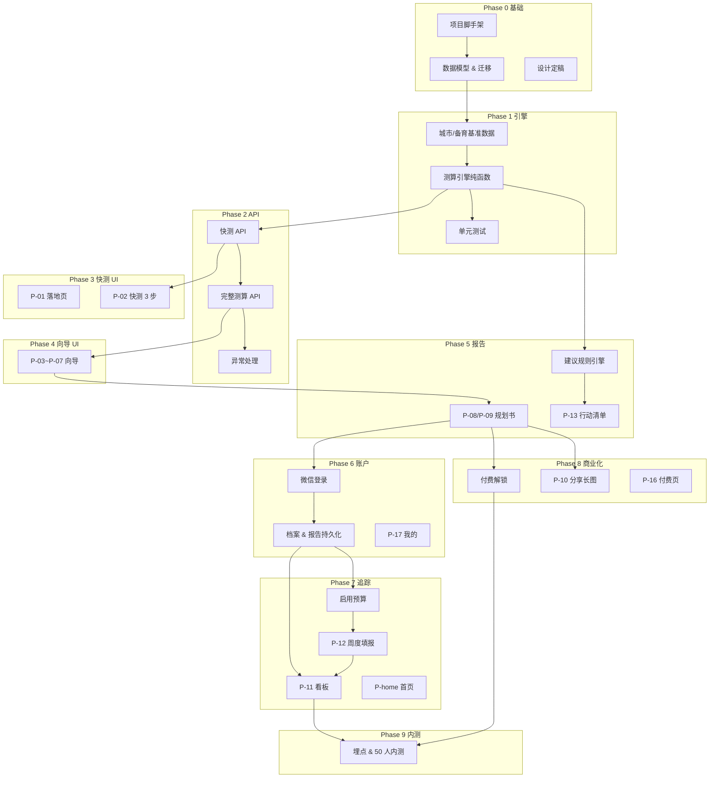

# 家计通 · 详细开发计划

**文档类型**：开发排期与交付计划  
**关联文档**：[PDD 楔子版](PDD-新婚备育家庭财务规划教练.md)、[UI 原型 v1](UI-原型设计.md)、[UI 原型 v2](UI-原型设计-v2-暖光版.md)  
**文档版本**：V1.0  
**撰写日期**：2026-06-11  
**总周期**：MVP 10 周（可演示 8 周 + 内测缓冲 2 周）+ P1 扩展 4 周  

---

## 一、计划原则

### 1.1 为什么这样排

PDD 原排期按「设计 → 引擎 → 页面 → 付费」线性推进，存在两个测试断层：

1. **W3–W4 无登录**：向导与报告可走通，但数据不落库，无法验证「启用预算 → 看板追踪」闭环。  
2. **W7 才做登录**：看板/周度填报（W6）只能 mock 数据，联调时改动面大。

本计划采用 **「引擎先行 + 垂直切片 + 每阶段可演示」**：

- 每个阶段结束都有 **明确的 Demo 场景** 和 **验收用例**，不堆到最后联调。
- 功能按 **数据依赖** 排序：基准数据 → 测算 → 报告 → 持久化 → 追踪 → 商业化。
- 同一阶段内 **先后端 API、再小程序页面**，避免 UI 写死 mock 后再改。

### 1.2 依赖关系总览



### 1.3 里程碑与可演示版本

| 里程碑 | 周次 | 可演示场景 | 核心验证 |
|--------|------|------------|----------|
| **M0** 工程就绪 | W0 末 | 本地启动前后端 | 健康检查、DB 迁移 |
| **M1** 引擎可用 | W1 末 | Postman 调快测/完整测算 | 20+ 单测、10 城有结果 |
| **M2** 快测闭环 | W2 末 | 小程序：落地页 → 3 步 → 健康分 | 3 分钟内看到结果 |
| **M3** 规划闭环 | W3 末 | 完整向导 → 规划书预览 | 备育分支、收支失衡拦截 |
| **M4** 报告完整 | W4 末 | 完整报告 + Top 5 建议 | 规则触发、排序正确 |
| **M5** 账户闭环 | W5 末 | 登录 → 保存 → 再次打开可看报告 | 数据持久化 |
| **M6** 追踪闭环 | W6 末 | 启用预算 → 填报 → 看板更新 | 进度条、超支配色 |
| **M7** 商业闭环 | W7 末 | 付费解锁 + 分享长图 | 沙箱支付、blur 解除 |
| **M8** 内测版 | W8–W9 | 50 人完整主流程 | 漏斗埋点、P0 bug=0 |
| **M9** P1 增强 | W10–W12 | 伴侣 + 复盘 + 订阅消息 | 邀请关联、推送到达 |

---

## 二、技术架构与仓库结构

> **已定稿**：前端 **UniApp（Vue 3）**，后端 **微信云开发（云函数 + 云数据库）**。完整规格见 [技术方案-UniApp云开发.md](技术方案-UniApp云开发.md)。

### 2.1 技术选型

| 层 | 选型 | 说明 |
|----|------|------|
| 客户端 | UniApp → mp-weixin | MVP 仅微信小程序；UI 对齐 prototype-v2 |
| 后端 | 微信云函数 `api` 网关 | 无独立服务器，openid 自动鉴权 |
| 数据库 | 云数据库（MongoDB 型） | 客户端禁止直连，仅云函数读写 |
| 测算引擎 | `cloudfunctions/common/engine` | 基准 JSON 内置，零读库成本 |
| 支付 | 云开发 cloudPay | `payNotify` 回调云函数 |
| 分享长图 | 客户端 Canvas | 零云算力 |

### 2.2 仓库结构

```
jiajitong/
├── uniapp/                   # UniApp + cloudfunctions/
├── docs/
├── prototype/                # v1 HTML 原型
└── prototype-v2/             # v2 HTML 原型（UI 参考）
```

### 2.3 环境划分

| 环境 | 云开发 envId | 用途 |
|------|--------------|------|
| jiajitong-dev | dev-xxx | 日常开发 |
| jiajitong-staging | stg-xxx | 体验版 QA |
| jiajitong-prod | prod-xxx | 正式版 |

### 2.4 API 形态说明

开发计划附录 A 的 REST 端点，在云开发中统一映射为 **`callFunction('api', { action, payload })`**。action 清单见 [技术方案 §5.2](技术方案-UniApp云开发.md#52-api-网关路由表)。

---

## 三、分阶段详细计划

---

### Phase 0：工程基础与设计冻结（W0，约 5 天）

**目标**：所有人能在本地跑通空项目；UI 与 API 契约冻结，后续不反复改。

#### 交付物

| # | 任务 | 负责 | 产出 |
|---|------|------|------|
| 0.1 | 仓库初始化、CI（lint + test） | 后端 | monorepo、GitHub Actions |
| 0.2 | 云数据库集合 + 索引 + 安全规则 | 后端 | 见 [技术方案 §4](技术方案-UniApp云开发.md#四云数据库设计) |
| 0.3 | UniApp 空壳 + Tab 框架 + 云开发 init | 前端 | 3 Tab + custom-tab-bar |
| 0.4 | 云函数 `api` 骨架 + `cities.list` | 后端 | action 路由可用 |
| 0.5 | **设计定稿** | 设计/产品 | 选定 v1 或 v2 视觉；切图标注 |
| 0.6 | **OpenAPI 草案 v0.1** | 后端 | 见附录 A 端点清单 |
| 0.7 | 埋点方案 | 产品 | 漏斗事件名表 |

#### 验收标准

- [ ] 微信开发者工具连接云开发 dev 环境
- [ ] UniApp 编译 mp-weixin 可打开 3 Tab 空页
- [ ] `callFunction('api', { action: 'cities.list' })` 返回 10 城
- [ ] 原型页面清单与 PDD §3.3 一一对应（31 屏已有 HTML 参考）

#### 测试要点

- 集成测试：migration 在空库/已有库均可跑
- 无需业务逻辑测试

---

### Phase 1：测算引擎 + 基准数据（W1，5 天）

**目标**：不依赖 UI，引擎可独立验证。这是全产品地基，**不可跳过**。

#### 交付物

| # | 任务 | 说明 |
|---|------|------|
| 1.1 | `packages/benchmark-data` | 10 城 × 7 大类人均月消费（PDD 附录 B） |
| 1.2 | 备育基准 seed | 首年育儿增量分项（奶粉/托育/医疗/用品） |
| 1.3 | `calcQuick(input)` | 输入：city, income, housing → 健康分 + 生活预算区间 + 1 条建议 |
| 1.4 | `calcFull(input)` | 完整向导字段 → PDD §6.1 输出 JSON |
| 1.5 | `calcHealthScore()` | PDD §6.2.3 四维权重 |
| 1.6 | `calcBabyReserve()` | PDD §6.2.4 备育储备 |
| 1.7 | 异常检测 | 收支失衡 ≥90%、城市未覆盖、备育时间 <6 月 |

#### 单元测试用例（最少 20 条）

| 类别 | 示例 |
|------|------|
| 基准 | 上海月入 32000、房贷 11000 → 可支配区间合理 |
| 阶段系数 | 备育中 vs 新婚 → 医疗类上浮 |
| 健康分 | 储蓄率 20%、固定 45%、备用金 6 月 → 分 ≥75 |
| 边界 | 固定支出 89% → 通过；91% → 抛 `IMBALANCE_ERROR` |
| 城市 | 未覆盖城市 → 新一线 fallback + `city_estimated` 标记 |
| 备育 | 12 个月后生育、储备不足 → 触发 R-N01 条件为 true |

#### 验收标准

- [ ] `packages/engine` 测试覆盖率 ≥ 85%（核心计算函数）
- [ ] 任意 10 城输入可在 <50ms 内完成（纯函数）
- [ ] 输出 JSON 符合 PDD §6.1 schema（JSON Schema 校验）

#### Demo

```bash
# CLI 示例（建议做一个 scripts/calc-demo.ts）
npx calc-demo --city=上海 --income=32000 --housing=11000
# → health_score: 78, disposable_range: [8200, 10800], top_recommendation: "..."
```

---

### Phase 2：核心 API 层（W2 前半，3 天）

**目标**：小程序与引擎之间只通过 API 通信；Postman 可测完整测算。

#### API 端点（本期实现）

| 方法 | 路径 | 说明 |
|------|------|------|
| GET | `/api/v1/cities` | 开放城市列表 + tier |
| POST | `/api/v1/calc/quick` | 免登录快测 |
| POST | `/api/v1/calc/full` | 完整测算（免登录，返回 plan 不落库） |
| GET | `/api/v1/calc/preview/:sessionId` | 可选：临时 session 存测算结果（Redis 24h） |

#### 交付物

- 请求/响应 TypeScript 类型与 `shared-types` 同步
- Postman/Bruno collection（提交到仓库）
- 统一错误码：`CITY_NOT_COVERED`、`IMBALANCE`、`VALIDATION_ERROR`

#### 验收标准

- [ ] Collection 中 8 条用例全部通过
- [ ] 响应时间 P95 ≤ 500ms（无 DB 写入）
- [ ] 错误响应含 `code` + `message` + `user_hint`（供 UI 展示）

#### 测试要点

- 契约测试：响应体通过 JSON Schema
- 负载：100 并发快测无 5xx（staging）

**衔接说明**：Phase 2 完成后，**前端可以开始 Phase 3**，与 Phase 2 后半（session 存储优化）并行。

---

### Phase 3：免登录快测 UI（W2 后半 – W3 前半，4 天）

**目标**：第一个 **端到端可给用户看** 的版本（M2）。

#### 页面

| 页面 | 原型 ID | 依赖 |
|------|---------|------|
| 落地页 | P-01 | 无 |
| 快测 Step 1–3 | P-02 | `GET /cities`、`POST /calc/quick` |
| 快测结果 | P-02 结果 | 健康分环、预算区间、1 条建议 |
| 城市未覆盖 | error-city | API `CITY_NOT_COVERED` |
| 收支失衡 | error-imbalance | API `IMBALANCE` |

#### 交互要点

- 步骤 pip / 滑块联动（参考 `prototype-v2`）
- 结果页健康分 **数字递增动画**（纯前端）
- 底部 CTA：「登录看完整规划书」→ 暂跳向导入口（登录 Phase 6 再接）

#### 验收标准

- [ ] 从落地页到结果 ≤ 3 分钟（真人测试 n≥3）
- [ ] 与 Postman 同输入结果一致（误差 0）
- [ ] 弱网：loading 态、超时 Toast

#### 测试清单

| # | 步骤 | 期望 |
|---|------|------|
| T3-1 | 选上海 → 32000 → 11000 | 健康分 70–85，有预算区间 |
| T3-2 | 选「即将开放」城市 | 跳转 error-city 或 fallback 提示 |
| T3-3 | 固定支出 92% | 阻断，error-imbalance |
| T3-4 | 返回上一步 | 保留已填数据 |

**本阶段刻意不做**：登录、保存、看板——避免分散精力。

---

### Phase 4：完整测算向导（W3 后半 – W4 前半，4 天）

**目标**：M3——从快测升级到 5 步向导，输出完整 plan JSON。

#### 页面

| 页面 | 说明 |
|------|------|
| P-03 Step 1 | 家庭阶段 pick-card；选备育解锁 Step 4 分支 |
| P-04 Step 2 | 城市 + 收入 + 稳定性 |
| P-05 Step 3 | 固定开销列表；实时固定占比进度 |
| P-06 Step 4 | 储蓄 + 备育储备 + 计划生育日期 |
| P-05-warn | 固定 >50% 黄色提示（不阻断） |
| P-07 Step 5 | 汇总卡片 + 生成按钮 + loading 三步骤文案 |

#### 状态管理

```
推荐：wizardStore（小程序 globalData 或 Pinia 等价）
  ← 快测完成后「一键带入」city / income / housing
  → Step 5 提交 POST /calc/full
  → 结果存内存 + 可选 sessionId（Redis）
```

#### 验收标准

- [ ] 5 步均可前进/后退，数据不丢
- [ ] 备育用户 Step 4 出现储备模块
- [ ] 生成动画 ≤2s 后进入报告预览
- [ ] 与 Phase 3 快测字段互通（从快测结果页进入向导时预填）

#### 测试清单

| # | 场景 | 期望 |
|---|------|------|
| T4-1 | 新婚路径 | 无备育模块 |
| T4-2 | 备孕中路径 | 有储备金推荐默认值 |
| T4-3 | 从快测进入 | 城市/收入/房贷已填 |
| T4-4 | Step 5 返回修改 | 可回到 Step 3 改固定项 |

---

### Phase 5：规划书 + 建议规则（W4 后半 – W5 前半，4 天）

**目标**：M4——产品「价值峰值」页面；规则引擎接入。

#### 页面

| 页面 | 说明 |
|------|------|
| P-08 预览 | 免费：健康分、总预算、1 条建议、2 类预算；其余 blur |
| P-09 完整 | 7 类预算表、备育专项、抗风险、全部建议 |
| P-13 行动清单 | 建议卡片 + 采纳/稍后/忽略（状态可先 localStorage） |

#### 后端

| # | 任务 |
|---|------|
| 5.1 | `packages/engine/rules` — R01–R07 + R-N01–N07 |
| 5.2 | 建议排序：影响 × 可执行性 × 阶段权重 |
| 5.3 | `POST /calc/full` 响应含 `recommendations[]` |

#### 验收标准

- [ ] 报告 7 块结构与 PDD §5.3 一致
- [ ] 备育用户可见「备育专项」区块
- [ ] 至少 3 个 fixture 家庭触发不同 R-N 规则
- [ ] 预览页 blur 区域点击 → 跳转付费页占位

#### 测试要点

- 规则单测：每条 R-N 至少 1 正例 + 1 反例
- 快照测试：完整 JSON 输出（防止公式改动无意回归）

**衔接说明**：本阶段报告仍可不落库；「启用预算追踪」按钮可先 Toast「即将开放」，Phase 7 再接真实逻辑。

---

### Phase 6：微信登录 + 数据持久化（W5 后半，3 天）

**目标**：M5——用户数据可保存；为追踪闭环做准备。**必须在看板之前完成。**

#### API

| 方法 | 路径 | 说明 |
|------|------|------|
| POST | `/api/v1/auth/wechat` | code → openid → JWT |
| POST | `/api/v1/families` | 创建家庭 + FinancialProfile |
| PUT | `/api/v1/families/:id/profile` | 更新档案 |
| POST | `/api/v1/plans` | 保存 BudgetPlan，返回 plan_id |
| GET | `/api/v1/plans/active` | 当前家庭生效方案 |
| GET | `/api/v1/plans/:id` | 规划书详情 |

#### 页面

| 页面 | 说明 |
|------|------|
| login | 微信一键登录 |
| P-17 我的 | 昵称、头像、家庭阶段 |
| family-profile | 档案只读/编辑入口 |
| privacy | 隐私说明、导出/删除入口（删除可 Phase 9 完善） |

#### 数据流

```
向导完成 → 登录（若未登录）→ POST /plans
  → FinancialProfile 入库
  → BudgetPlan.is_active = true（若用户点「启用预算」）
快测 session → 登录后 merge 到 FinancialProfile（可选增强）
```

#### 验收标准

- [ ] 登录后再次打开小程序，首页显示上次健康分
- [ ] 同一 openid 重复登录不重复建家庭
- [ ] 敏感字段（income）DB 加密存储
- [ ] 未登录访问 `/plans/active` 返回 401

#### 测试清单

| # | 场景 | 期望 |
|---|------|------|
| T6-1 | 新用户登录 → 完成向导 → 杀进程重开 | 报告仍在 |
| T6-2 | 快测后登录 | 向导预填仍有效 |
| T6-3 | 切换测试号 | 数据隔离 |

---

### Phase 7：预算追踪闭环（W6，5 天）

**目标**：M6——**北极星指标**「启用预算并追踪」可跑通。

#### API

| 方法 | 路径 | 说明 |
|------|------|------|
| POST | `/api/v1/plans/:id/activate` | 启用追踪（设 is_active） |
| GET | `/api/v1/dashboard` | 本月总进度 + 7 类 + 备育进度 |
| POST | `/api/v1/weekly-entries` | 提交周度填报 |
| GET | `/api/v1/weekly-entries/current` | 本周是否已填 |
| PUT | `/api/v1/weekly-entries/:id` | 修改本周 |

#### 页面

| 页面 | 说明 |
|------|------|
| P-home | Bento：健康分、备育进度、行动入口、重新测算 |
| home-empty | 无 plan 时的空态 |
| P-11 看板 | 总进度条 + 7 类 + 备育条 |
| dashboard-empty | 未启用预算空态 |
| P-12 周度填报 | 7 数字 + 复制上周 |
| setup-reminder | 订阅消息授权引导 |

#### 看板计算逻辑

```
某类已用 = 当月所有 WeeklyEntry 该类之和
某类进度 = 已用 / BudgetPlan.categories[id].suggested
总进度 = sum(已用) / 可支配预算
颜色：<70% 绿、70–90% 黄、>90% 红
```

#### 验收标准

- [ ] 点击「启用预算追踪」后看板从 0% 开始
- [ ] 填报 ¥500 餐饮后，餐饮进度立即更新
- [ ] 「复制上周」复制 7 类数值
- [ ] 某类 ≥80% 时看板显示警告态（推送 Phase P1）
- [ ] 备育用户首页可见储备进度条

#### 测试清单

| # | 场景 | 期望 |
|---|------|------|
| T7-1 | 启用 → 填一周 → 看板 | 百分比正确 |
| T7-2 | 同周重复提交 | 覆盖而非 duplicate |
| T7-3 | 跨月 | 月初进度重置 |
| T7-4 | 未启用进看板 | 空态 + CTA |

**衔接说明**：Phase 5 的「行动清单采纳」可在本阶段改为写入 DB（`recommendation_status` 表），或继续 localStorage 至 P1。

---

### Phase 8：商业化 + 分享（W7，5 天）

**目标**：M7——付费解锁与裂变传播。

#### API

| 方法 | 路径 | 说明 |
|------|------|------|
| POST | `/api/v1/orders` | 创建订单（report_once / pro_yearly） |
| POST | `/api/v1/orders/:id/notify` | 微信支付回调 |
| GET | `/api/v1/subscription` | 当前权益 |
| POST | `/api/v1/share/poster` | 生成分享长图 URL |

#### 页面

| 页面 | 说明 |
|------|------|
| P-16 付费页 | 单次报告 ¥19.9 / Pro ¥68 年 |
| P-08 解锁态 | 根据 subscription 去掉 blur |
| P-10 分享长图 | canvas 绘制 + 保存相册 |
| PDF 导出 | Pro 专属；可用云函数渲染 |

#### 权益矩阵（实现为 middleware）

| 能力 | free | report_once | pro |
|------|------|-------------|-----|
| 完整 7 类预算 | ❌ | ✅ 7天 | ✅ |
| 全部建议 | ❌ | ✅ | ✅ |
| PDF | ❌ | ✅ | ✅ |
| 无限次测算 | 1次/月 | — | ✅ |

#### 验收标准

- [ ] 微信支付沙箱：付费成功后 3s 内解锁
- [ ] 免费用户仅见 2 类预算 + 1 条建议
- [ ] 分享长图不含具体收入（默认脱敏）
- [ ] 长图扫码回到落地页/快测

#### 测试清单

| # | 场景 | 期望 |
|---|------|------|
| T8-1 | 购买单次报告 | 解锁 + expires_at 正确 |
| T8-2 | 已是 Pro 进付费页 | 显示已订阅 |
| T8-3 | 生成分享图 | 二维码可扫 |

---

### Phase 9：内测与质量（W8–W9，10 天）

**目标**：M8——50 人内测，P0 清零，漏斗可观测。

#### 任务

| # | 任务 |
|---|------|
| 9.1 | 埋点：落地页 → 开始测算 → 完成 → 启用 → 7日留存 |
| 9.2 | 备育基准数据校准（对比 2–3 个公开数据源） |
| 9.3 | 性能：首屏 ≤1.5s、测算 ≤2s |
| 9.4 | 安全审计：加密、权限、越权访问 family |
| 9.5 | 小程序审核材料：隐私政策、用户协议 |
| 9.6 | 内测反馈 → P0/P1 bug 分流 |

#### 内测准入标准（Go/No-Go）

| 检查项 | 标准 |
|--------|------|
| 主流程 | 100% 可走通（T3–T8 回归） |
| P0 bug | 0 |
| 测算完成率 | 内测群 ≥60% |
| 崩溃率 | <1% |

#### 测试矩阵（发布前全量回归）

```
        快测  向导  报告  登录  看板  填报  付费  分享
新婚      ✓    ✓    ✓    ✓    ✓    ✓    ✓    ✓
备育      ✓    ✓    ✓    ✓    ✓    ✓    ✓    ✓
未覆盖城  ✓    —    —    —    —    —    —    —
收支失衡  ✓    ✓    —    —    —    —    —    —
```

---

### Phase 10：P1 扩展（W10–W12，可选）

**依赖 MVP 稳定后再做，避免与内测抢资源。**

| 周次 | 功能 | 页面/API | 验证 |
|------|------|----------|------|
| W10 | 伴侣邀请 | P-14、`POST /families/invite` | B 扫码关联同一 family |
| W10 | 共享只读 | 伴侣角色权限 middleware | B 不能改预算 |
| W11 | 月末复盘 | P-15、`GET /reports/monthly` | 月初自动生成 |
| W11 | 订阅消息 | 周度提醒、超支预警 | 授权率、到达率 |
| W12 | 城市扩 20 城 | benchmark seed | 新城测算可用 |
| W12 | 管理后台 v0.1 | 基准 CSV 上传 | 运营可改系数 |

---

## 四、API 与页面对照表（全量）

| 阶段 | 页面 ID | API 依赖 | 前置阶段 |
|------|---------|----------|----------|
| 3 | P-01, P-02 | `/cities`, `/calc/quick` | 1, 2 |
| 4 | P-03~P-07 | `/calc/full` | 1, 2 |
| 5 | P-08, P-09, P-13 | `/calc/full`（富化） | 4 |
| 6 | login, P-17 | `/auth`, `/families`, `/plans` | 5 |
| 7 | P-home, P-11, P-12 | `/dashboard`, `/weekly-entries` | 6 |
| 8 | P-10, P-16 | `/orders`, `/share` | 6, 5 |
| 10 | P-14, P-15 | `/invite`, `/reports/monthly` | 7 |

---

## 五、人员分工建议（小团队）

| 角色 | W1–W2 | W3–W5 | W6–W7 | W8–W9 |
|------|-------|-------|-------|-------|
| 后端 | 引擎 + API | 持久化 + 规则 | 看板 API + 支付 | 内测支持 |
| 前端 | 联调 Postman | 快测 + 向导 + 报告 | 看板 + 付费 | bugfix |
| 产品/设计 | 基准数据校对 | 走查 UI | 付费文案 | 内测运营 |
| QA | 引擎单测 | 每 Phase 测试清单 | 全量回归 | 内测跟踪 |

2 后端 + 2 前端 + 1 产品 可并行；Phase 3 起前端与后端可拆子分支按 API 契约开发。

---

## 六、分支与发布策略

```
main          ← 仅合并通过 staging 验证的代码
develop       ← 日常集成
feature/phase-N-* 
release/m2    ← M2 快测演示 tag
release/mvp   ← 内测 tag
```

**每个 Milestone 打 tag**，便于演示 rollback，例如 `v0.2.0-m2-quicktest`。

---

## 七、风险与缓冲

| 风险 | 影响 | 缓冲措施 |
|------|------|----------|
| 基准数据不准 | 用户信任 | W1 预留 1 天校对；内测问卷 |
| 微信审核慢 | 上线延迟 | W8 提前提交审核；先用体验版 |
| 支付资质 | 商业化阻塞 | W6 开始准备商户号；Phase 8 先用 mock 解锁开发 |
| 规则过多 | W5 延期 | 首期只上 R01–R05 + R-N01–N04，其余 P1 |
| 登录放太晚 | 已在本计划 W5 解决 | — |

**总缓冲**：W8–W9 共 2 周；若 M7 按时完成，W9 后半可提前开 P1。

---

## 八、Weekly 日历一览

| 周 | 阶段 | 里程碑 | 演示给 stakeholder |
|----|------|--------|-------------------|
| W0 | Phase 0 | M0 | 空壳 + DB |
| W1 | Phase 1 | M1 | CLI 测算结果 |
| W2 | Phase 2–3 | M2 | **小程序快测** |
| W3 | Phase 4 | M3 | **完整向导 → 预览** |
| W4 | Phase 5 | M4 | **完整规划书** |
| W5 | Phase 6 | M5 | **登录保存** |
| W6 | Phase 7 | M6 | **看板 + 周度填报** |
| W7 | Phase 8 | M7 | **付费 + 分享** |
| W8–W9 | Phase 9 | M8 | **内测版** |
| W10–12 | Phase 10 | M9 | 伴侣 + 复盘 |

---

## 附录 A：OpenAPI 端点清单（MVP）

```
GET    /health
GET    /api/v1/cities
POST   /api/v1/calc/quick
POST   /api/v1/calc/full
POST   /api/v1/auth/wechat
POST   /api/v1/families
GET    /api/v1/families/:id
PUT    /api/v1/families/:id/profile
POST   /api/v1/plans
GET    /api/v1/plans/active
GET    /api/v1/plans/:id
POST   /api/v1/plans/:id/activate
GET    /api/v1/dashboard
POST   /api/v1/weekly-entries
GET    /api/v1/weekly-entries/current
POST   /api/v1/orders
POST   /api/v1/orders/wechat/notify
GET    /api/v1/subscription
POST   /api/v1/share/poster
DELETE /api/v1/users/me              # 账号删除（Phase 9）
```

## 附录 B：埋点事件（MVP 漏斗）

| 事件名 | 触发时机 | 属性 |
|--------|----------|------|
| `page_view` | 每页 onShow | page_id |
| `calc_quick_start` | 点击免费测算 | source |
| `calc_quick_done` | 快测结果展示 | city, health_score |
| `calc_wizard_start` | 进入向导 Step1 | from_quick: bool |
| `calc_wizard_done` | 报告预览展示 | stage, health_score |
| `plan_activate` | 启用预算追踪 | plan_id |
| `weekly_submit` | 周度填报提交 | week, total |
| `pay_show` | 进入付费页 | trigger |
| `pay_success` | 支付成功 | sku |
| `share_poster` | 保存分享图 | — |

## 附录 C：与 PDD 原排期差异说明

| PDD 原排期 | 本计划调整 | 原因 |
|------------|------------|------|
| W1 设计 | W0 设计 + W1 引擎 | 设计提前，引擎不与 UI 抢 W1 |
| W6 看板在登录前 | W6 看板在 W5 登录后 | 看板需要 family_id / plan_id |
| W7 登录+付费 | W5 登录、W7 付费 | 登录提前支撑追踪测试 |
| W8 内测 | W8–W9 内测 | 增加 1 周缓冲 |

---

**文档结束**
