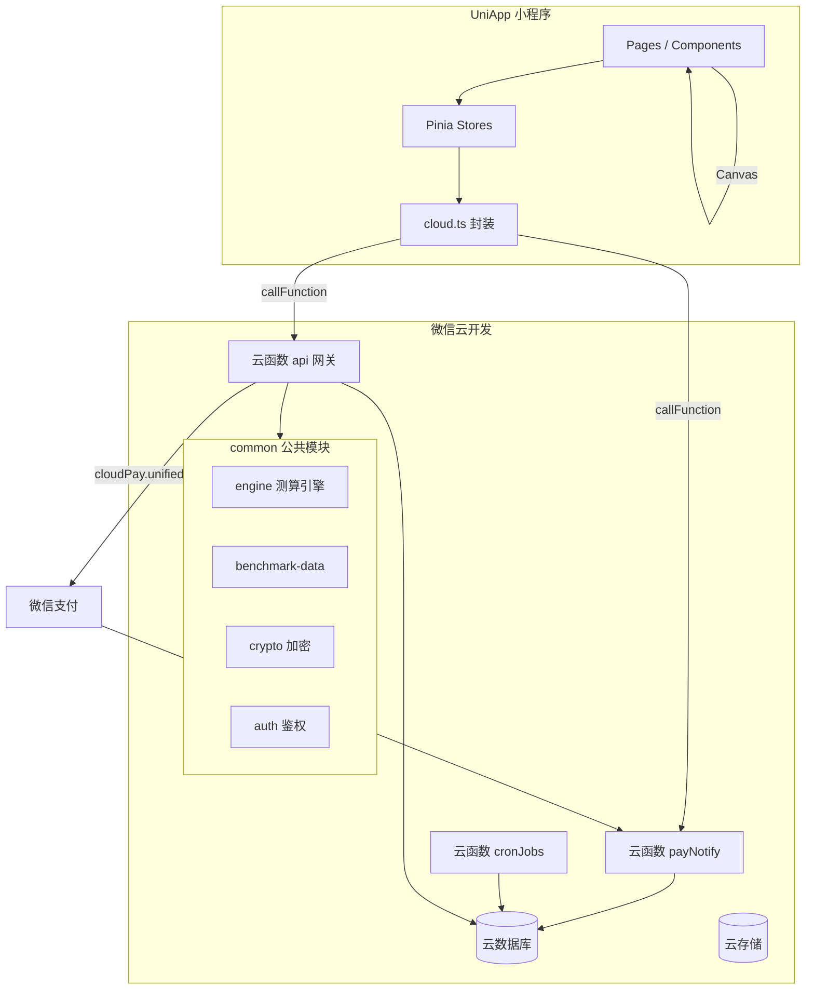
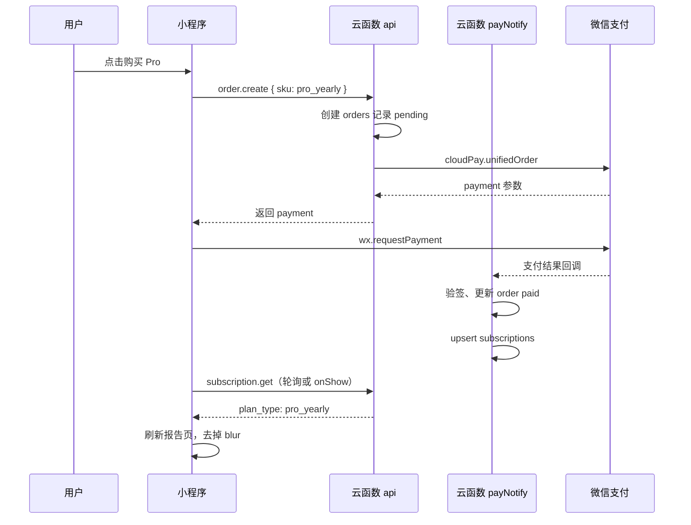

# 家计通 · 技术实现方案（UniApp + 微信云开发）

**文档类型**：技术架构与实现规格  
**关联文档**：[PDD 楔子版](PDD-新婚备育家庭财务规划教练.md)、[开发计划](开发计划.md)、[UI 原型 v2](UI-原型设计-v2-暖光版.md)  
**文档版本**：V1.1  
**撰写日期**：2026-06-11  
**修订日期**：2026-06-30（补工程迁移说明、修正代码片段、补全集合设计）  
**适用范围**：MVP（微信小程序）+ P1 扩展  

---

## 〇、工程现状与迁移（实施前必读）

> 本节为 V1.1 新增。实施任何代码前，请先读完本节。

### 0.1 现有工程现状

当前仓库 `uniapp/NestPlan/` 为 **DCloud uniCloud 官方示例工程**，采用 uniCloud（阿里云）体系，包含：

- `uniCloud-alipay/`：50 个 uniCloud 云函数 + 62 个 database schema（uniCloud 体系，**非**微信云开发）
- `pages/`：`cloudFunction`、`cloudObject`、`clientDB`、`storage`、`schema2code` 等官方 demo 页面
- `pages.json` TabBar 为 5 个 demo 入口（云函数/云对象/云存储/clientDB/schema2code）
- `uni_modules/`：`uni-id-pages`、`uni-upgrade-center` 等 uniCloud 强依赖模块
- `manifest.json`：mp-weixin 节无 `cloudfunctionRoot`，`urlCheck: false`

**该工程与本方案「微信云开发 `wx.cloud`」架构根本不兼容**，不能在其基础上改造，须新建工程。

### 0.2 处置方案

| 工程目录 | 处置 | 说明 |
|----------|------|------|
| `uniapp/NestPlan/` | **保留归档，不用于正式开发** | 作为 uniCloud 写法参考；可后续 `git mv` 至 `archive/uniCloud-demo/` |
| `uniapp/`（正式工程根） | **新建承载正式工程** | 下设 `src/`（UniApp 源码）+ `cloudfunctions/`（微信云函数） |
| `uniapp/src/` | 正式 UniApp 工程 | 按本文档 §3 工程结构落地 |
| `uniapp/cloudfunctions/` | 正式云函数 | 按本文档 §3、§五落地，`project.config.json` 的 `cloudfunctionRoot` 指向此处 |

> **新建工程命令参考**（HBuilderX 或 CLI）：创建 UniApp Vue3 项目后，删除模板 demo 页，按 §3 结构与 §8.1 `pages.json` 重建。`manifest.json` 按附录 B（新建工程最小配置）设置 `cloudfunctionRoot`。

### 0.3 路径与命名统一规则

1. **引擎与基准数据路径**：统一以本方案 `cloudfunctions/common/` 为准。
   - [开发计划](开发计划.md) 中出现的 `packages/benchmark-data`、`packages/engine`、`packages/engine/rules` 路径，**均映射到 `cloudfunctions/common/engine` 与 `cloudfunctions/common/benchmark-data`**。
   - 微信云开发的公共模块必须随云函数一起部署，npm workspace 的 `packages/` 风格不适用。
   - 单测与脚本（`scripts/test-engine.js`）通过相对路径 `require('../uniapp/cloudfunctions/common/engine')` 引用同一份代码，避免重复维护（详见 §7.2）。
2. **分包目录大小写**：统一为小写 `subpackages`（目录名、`pages.json` 的 `subPackages[].root` 值均小写），微信小程序路径大小写敏感。
3. **附录 B manifest** 定位为「**新建工程最小配置**」，仅含 mp-weixin 必要字段；如需保留 5+App/H5 能力，自行合并 `app-plus`/`h5` 节，不影响本方案微信小程序主线。

### 0.4 实施顺序提示

实施时遵循 [开发计划 Phase 0](开发计划.md)：先建空 UniApp 工程 + 云函数骨架 + 集合索引（本文档 §4），再做引擎（§7），最后接页面（§6）。本文档各章按此顺序组织。

---

## 一、架构决策

### 1.1 技术栈（最终选型）

| 层 | 选型 | 说明 |
|----|------|------|
| 前端框架 | **UniApp（Vue 3 + Pinia + Vite）** | 单代码库；MVP **仅编译 mp-weixin** |
| 后端 | **微信云开发 CloudBase** | 云函数 + 云数据库 + 云存储 |
| 计算引擎 | **云函数公共模块 `common/engine`** | 纯 JS，与 PDD §6 公式一致 |
| 基准数据 | **云函数内置 JSON**（非 DB 读取） | 10 城 + 备育基准，零读库成本 |
| 支付 | **云开发云调用 `cloudPay`** | 免自建支付回调服务器 |
| 定时任务 | **云函数定时触发器** | 周度提醒、月末复盘 |
| 分享长图 | **客户端 Canvas** | 零云函数算力；可选上传云存储 |

> **重要区分**：本文档指 **微信云开发**（`wx.cloud`），**不是** DCloud 的 uniCloud。UniApp 通过条件编译调用 `wx.cloud`。

### 1.2 为什么不用独立服务器 + PostgreSQL

| 维度 | 独立服务器 | 微信云开发（本方案） |
|------|------------|----------------------|
| MVP 月成本 | ¥200–500（云主机+DB+域名） | **¥0–30**（免费额度内） |
| 运维 | 需部署、监控、SSL | 微信控制台一键 |
| 登录 | 自建 session/JWT | **openid 自动注入云函数** |
| 支付回调 | 公网 HTTPS 域名 | **cloudPay 内置** |
| 适合阶段 | 10 万 DAU+ | **内测 ~ 5000 DAU** |

**演进路径**：测算引擎抽为 npm 包；DAU 过万后，云函数可迁移至腾讯云 SCF + MongoDB，前端仅改 `services/cloud.ts` 一层。

### 1.3 核心架构图



### 1.4 安全原则（不可妥协）

1. **业务库禁止客户端直连读写**：所有 `users / families / plans` 等集合安全规则设为 `read: false, write: false`。
2. **唯一数据入口**：`api` 云函数网关，内部做 openid 鉴权 + family 归属校验。
3. **敏感字段加密**：月收入等 AES-256-GCM 加密后入库，密钥仅存云函数环境变量。
4. **伴侣只读**：`role === 'partner'` 时，写操作一律拒绝。

---

## 二、成本规划

### 2.1 微信云开发免费额度（2025/2026 参考，以控制台为准）

| 资源 | 免费额度 | MVP 预估用量（500 用户） |
|------|----------|--------------------------|
| 云函数调用 | 20 万次/月 | ~3 万次 |
| 云函数资源 | 4 万 GBs/月 | ~500 GBs |
| 数据库容量 | 2 GB | < 50 MB |
| 数据库读 | 500 次/天/人… | 远低于上限 |
| 云存储 | 5 GB | 分享图 < 200 MB |
| CDN 流量 | 5 GB/月 | 静态资源分包 |

**结论**：内测 + 前 3 个月公测，**可控制在免费额度内**；付费项主要是超出后的云函数调用（约 ¥0.0133/万次）。

### 2.2 降本设计（写入代码规范）

| 策略 | 实现 |
|------|------|
| 基准数据不进 DB | JSON 打入 `common/benchmark-data`，测算零读库 |
| 网关单云函数 | MVP 仅 `api` + `payNotify` + `cronJobs` 三个函数 |
| 看板聚合服务端一次返回 | `dashboard.get` 合并 plan + entries，避免前端多次 callFunction |
| 分享长图客户端生成 | 不上传云存储（除非用户点「分享朋友圈」） |
| 埋点批量上报 | 客户端队列，每 5 条或退后台时 `track.batch` 一次 |
| 分页与字段裁剪 | 报告列表不返回 `calculation_basis` 等大字段 |

### 2.3 环境规划

| 环境 | 云开发 envId | 用途 |
|------|--------------|------|
| `jiajitong-dev` | dev-xxx | 开发、自动化测试 |
| `jiajitong-staging` | stg-xxx | 体验版、QA |
| `jiajitong-prod` | prod-xxx | 正式版 |

UniApp 通过 `.env.development` / `.env.production` 注入 `VITE_CLOUD_ENV`。

---

## 三、工程结构

```
jiajitong/
├── docs/                          # 已有文档
├── prototype/                     # HTML 原型（UI 参考）
├── uniapp/                        # ★ UniApp 主工程
│   ├── src/
│   │   ├── App.vue
│   │   ├── main.js
│   │   ├── pages.json             # 路由、TabBar、分包
│   │   ├── manifest.json          # mp-weixin appid、云开发开关
│   │   ├── uni.scss               # 设计 token（对齐 prototype-v2）
│   │   ├── pages/
│   │   │   ├── landing/           # P-01
│   │   │   ├── quick/             # P-02（3 步 + 结果）
│   │   │   ├── login/             # 登录
│   │   │   ├── home/              # Tab 首页
│   │   │   ├── dashboard/         # Tab 看板 P-11
│   │   │   ├── profile/           # Tab 我的 P-17
│   │   │   ├── weekly/            # P-12
│   │   │   ├── actions/           # P-13
│   │   │   ├── paywall/           # P-16
│   │   │   ├── partner/           # P-14
│   │   │   ├── review/            # P-15
│   │   │   ├── setup-reminder/    # 订阅消息授权（P1，§6.12）
│   │   │   ├── family/            # 家庭档案
│   │   │   ├── privacy/           # 隐私
│   │   │   └── error/             # 异常页
│   │   ├── subpackages/
│   │   │   ├── wizard/            # P-03~P-07 分包
│   │   │   └── report/            # P-08~P-10 分包
│   │   ├── components/
│   │   │   ├── ScoreRing.vue
│   │   │   ├── PickCard.vue
│   │   │   ├── TrackBar.vue
│   │   │   ├── GlassCard.vue
│   │   │   ├── StatusPill.vue
│   │   │   └── BlurLock.vue
│   │   ├── custom-tab-bar/       # 自定义 tabBar（§8.1 custom:true）
│   │   │   ├── index.vue         # 悬浮胶囊 Tab
│   │   │   └── index.json
│   │   ├── stores/
│   │   │   ├── user.js
│   │   │   ├── wizard.js
│   │   │   ├── plan.js
│   │   │   └── dashboard.js
│   │   ├── services/
│   │   │   ├── cloud.js           # callFunction 统一封装
│   │   │   ├── api.js             # 业务 action 映射
│   │   │   └── payment.js
│   │   ├── utils/
│   │   │   ├── format.js          # 金额、百分比
│   │   │   ├── week.js            # 自然周 week_start 计算
│   │   │   └── poster.js          # Canvas 分享长图
│   │   └── constants/
│   │       ├── categories.js      # 7 大类 ID
│   │       └── error-code.js
│   ├── cloudfunctions/            # ★ 云函数（与 uniapp 同级，微信开发者工具识别）
│   │   ├── api/
│   │   │   ├── index.js           # 网关路由
│   │   │   ├── package.json
│   │   │   └── config.json
│   │   ├── payNotify/
│   │   │   └── index.js
│   │   ├── cronJobs/
│   │   │   └── index.js
│   │   └── common/                # 公共模块（软链接或 npm file:）
│   │       ├── engine/
│   │       │   ├── calcQuick.js
│   │       │   ├── calcFull.js
│   │       │   ├── healthScore.js
│   │       │   ├── babyReserve.js
│   │       │   └── rules/         # R01-R07, R-N01-N07
│   │       ├── benchmark-data/
│   │       │   ├── cities.json
│   │       │   ├── city-benchmarks.json
│   │       │   └── baby-benchmarks.json
│   │       ├── db.js              # 集合访问封装
│   │       ├── auth.js            # 鉴权
│   │       ├── crypto.js
│   │       ├── response.js        # 统一响应
│   │       └── errors.js          # 错误码
│   ├── project.config.json        # 云函数根目录 cloudfunctionRoot
│   ├── package.json
│   └── vite.config.js
└── scripts/
    ├── seed-benchmarks.js         # 基准数据校验
    └── test-engine.js             # 引擎单测（Node 直接跑 common/engine）
```

### 3.1 UniApp 初始化（App.vue）

```javascript
import { initCloud } from '@/services/cloud'

export default {
  onLaunch() {
    // #ifdef MP-WEIXIN
    initCloud() // wx.cloud.init({ env, traceUser: true })；平台判断在 services/cloud.js 内
    this.bootstrapUser()
    // #endif
    // #ifndef MP-WEIXIN
    console.warn('家计通 MVP 仅支持微信小程序，当前平台不可用')
    // #endif
  },
  methods: {
    async bootstrapUser() {
      // #ifdef MP-WEIXIN
      const { userStore } = await import('@/stores/user')
      await userStore().bootstrap() // api action: user.bootstrap
      // #endif
    }
  }
}
```

> **写法要点**：`export default` 必须平台无关，仅把 `wx.cloud` 相关调用用 `#ifdef MP-WEIXIN ... #endif` 包裹。若整个 `export default` 被 `#ifdef` 包裹，非微信平台将缺少 App 组件定义导致编译失败。`initCloud()` 内部已做条件编译（见 §3.2），App.vue 直接调用即可。

### 3.2 云调用统一封装（services/cloud.js）

```javascript
const ENV = import.meta.env.VITE_CLOUD_ENV

export function initCloud() {
  // #ifdef MP-WEIXIN
  if (!wx.cloud) throw new Error('请使用 2.2.3+ 基础库')
  wx.cloud.init({ env: ENV, traceUser: true })
  // #endif
}

export async function callApi(action, payload = {}, options = {}) {
  const { showLoading = false, retry = 1 } = options
  if (showLoading) uni.showLoading({ title: '加载中', mask: true })
  try {
    const res = await wx.cloud.callFunction({
      name: 'api',
      data: { action, payload, requestId: genRequestId() }
    })
    const result = res.result
    if (result.code !== 0) {
      throw new BizError(result.code, result.message, result.userHint)
    }
    return result.data
  } catch (e) {
    if (retry > 0 && isNetworkError(e)) {
      return callApi(action, payload, { ...options, retry: retry - 1 })
    }
    throw e
  } finally {
    if (showLoading) uni.hideLoading()
  }
}
```

---

## 四、云数据库设计

### 4.1 集合清单

| 集合 | 说明 | 客户端直连 |
|------|------|------------|
| `users` | 用户主表 | ❌ 禁止 |
| `families` | 家庭 | ❌ 禁止 |
| `family_members` | 成员关系 | ❌ 禁止 |
| `financial_profiles` | 财务档案 | ❌ 禁止 |
| `budget_plans` | 预算方案/规划书 | ❌ 禁止 |
| `weekly_entries` | 周度填报 | ❌ 禁止 |
| `subscriptions` | 订阅权益 | ❌ 禁止 |
| `orders` | 支付订单 | ❌ 禁止 |
| `recommendation_status` | 建议采纳状态 | ❌ 禁止 |
| `family_invites` | 伴侣邀请 | ❌ 禁止 |
| `calc_sessions` | 免登录测算暂存 | ❌ 禁止 |
| `analytics_events` | 埋点（可选） | ❌ 禁止 |
| `app_config` | 运营配置 | ❌ 禁止 |

> **基准数据不建集合**，避免误改 + 节省读次数。

### 4.2 安全规则（全部集合统一）

```json
{
  "read": false,
  "write": false
}
```

所有读写经云函数 `cloud.database()` 执行（管理员权限）。

### 4.3 字段规格

#### users

```javascript
{
  _id: "auto",
  _openid: "wx_openid",           // 系统字段，云函数可获取
  unionid: "",                    // 可选
  nickname: "",
  avatar: "",
  family_id: "family_xxx",        // 所属家庭，创建时写入
  role: "owner",                  // owner | partner
  created_at: Date,
  updated_at: Date,
  last_active_at: Date
}
```

**索引**：`_openid`（唯一）

#### families

```javascript
{
  _id: "family_xxx",
  name: "晓雯 & 阿哲的小家",
  stage: "planning",              // newlywed | planning | pregnant
  stage_detail: "plan_1y",        // 计划 1 年内生育等
  city: "上海",
  city_tier: "tier1",
  city_estimated: false,          // 是否 fallback 估算
  plan_date: "2027-06",           // 计划生育 YYYY-MM，nullable
  owner_openid: "",
  created_at: Date,
  updated_at: Date
}
```

#### financial_profiles

```javascript
{
  _id: "auto",
  family_id: "",
  monthly_income_enc: "base64...", // AES 加密字符串
  income_stability: "stable",      // stable | bonus | volatile
  fixed_expenses: [                // 明文可接受（非精确身份）
    { key: "housing", label: "房贷/房租", amount: 11000 },
    { key: "car", label: "车贷", amount: 0 }
  ],
  savings_target: 6400,
  savings_target_type: "amount",    // amount | percent
  emergency_fund: 50000,
  baby_reserve_target: 80000,
  baby_reserve_current: 32000,
  updated_at: Date
}
```

**索引**：`family_id`（唯一）

#### budget_plans

```javascript
{
  _id: "plan_xxx",
  family_id: "",
  version: 1,
  health_score: 82,
  risk_level: "green",            // green | yellow | red
  is_active: true,                // 同一 family 仅一条 true
  monthly_summary: {
    income: 32000,                // 脱敏展示用，来自解密或快照
    fixed_expense: 13500,
    savings_target: 6400,
    disposable: 12100
  },
  categories: [ /* PDD §6.1 */ ],
  baby_reserve: { /* ... */ },
  recommendations: [ /* ... */ ],
  risk_report: { /* ... */ },
  created_at: Date,
  activated_at: Date              // 启用追踪时间
}
```

**索引**：`family_id + is_active`；`family_id + created_at`

#### weekly_entries

```javascript
{
  _id: "auto",
  family_id: "",
  week_start: "2026-06-09",       // 周一日期 ISO YYYY-MM-DD
  week_end: "2026-06-15",
  categories: {
    food: 720,
    daily: 180,
    entertainment: 500,
    medical: 0,
    clothing: 200,
    transport: 150,
    other: 80
  },
  total: 1830,
  created_at: Date,
  updated_at: Date
}
```

**索引**：`family_id + week_start`（唯一，云函数 upsert 保证）

#### subscriptions

```javascript
{
  _id: "auto",
  openid: "",
  family_id: "",
  plan_type: "pro_yearly",        // free | report_once | pro_yearly | pro_family
  expires_at: Date,
  source_order_id: "",
  created_at: Date
}
```

#### orders

```javascript
{
  _id: "order_xxx",
  openid: "",
  family_id: "",
  sku: "report_once",             // report_once | pro_yearly | pro_family
  amount_fen: 1990,
  status: "pending",              // pending | paid | failed | refunded
  wx_transaction_id: "",
  created_at: Date,
  paid_at: Date
}
```

#### calc_sessions（免登录暂存）

```javascript
{
  _id: "auto",
  _openid: "",
  type: "quick",                  // quick | full
  input: { /* 原始输入 */ },
  output: { /* calc 结果 */ },
  expire_at: Date,                // 创建 + 24h，cronJobs 清理
  created_at: Date
}
```

#### family_invites

```javascript
{
  _id: "invite_xxx",
  family_id: "",
  inviter_openid: "",
  invite_code: "6位随机",
  status: "pending",              // pending | accepted | expired
  expire_at: Date,
  created_at: Date
}
```

#### family_members

```javascript
{
  _id: "auto",
  family_id: "",
  openid: "",                     // 成员微信 openid
  role: "partner",                // owner | partner（owner 即 families.owner_openid，冗余记录便于查询）
  joined_at: Date,
  created_at: Date
}
```

**索引**：`family_id + openid`（唯一）

#### recommendation_status

```javascript
{
  _id: "auto",
  family_id: "",
  plan_id: "",
  rule_id: "R-N01",               // R01-R07 | R-N01-R-N07
  status: "later",                // adopted | later | ignored
  acted_at: Date,                 // 采纳时间，nullable
  created_at: Date,
  updated_at: Date
}
```

**索引**：`family_id + plan_id + rule_id`（唯一，云函数 upsert 保证）

#### analytics_events

```javascript
{
  _id: "auto",
  _openid: "",                    // 可空（免登录快测埋点）
  family_id: "",                  // 可空
  event: "quick_calc_submit",     // 事件名，见埋点事件名表
  props: { /* 事件属性，禁止含收入等敏感字段 */ },
  page: "pages/quick/step3",
  created_at: Date
}
```

**索引**：`_openid + created_at`；`event + created_at`

#### app_config

```javascript
{
  _id: "auto",
  key: "city_benchmarks_version", // 配置键
  value: "2026-06-01",
  updated_at: Date,
  updated_by: "system"            // system | openid
}
```

**索引**：`key`（唯一）

---

## 五、云函数设计

### 5.1 函数清单

| 云函数 | 触发 | 职责 |
|--------|------|------|
| `api` | callFunction | **唯一业务网关**，路由 `action` |
| `payNotify` | 微信支付回调 | 验签、更新 order/subscription |
| `cronJobs` | 定时（cron） | 清理过期 session、周提醒、月末复盘 |

### 5.2 api 网关路由表

| action | 鉴权 | 说明 |
|--------|------|------|
| `cities.list` | 否 | 开放城市列表 |
| `calc.quick` | 否* | 快测；*需 openid 限流 |
| `calc.full` | 否* | 完整测算 |
| `user.bootstrap` | 是 | 登录初始化，返回 user+family+activePlan |
| `user.updateProfile` | owner | 更新昵称等 |
| `family.update` | owner | 更新 stage/city/plan_date |
| `profile.updateFinancial` | owner | 更新财务档案 |
| `plan.save` | owner | 保存测算结果为新 plan |
| `plan.getActive` | member | 当前生效方案 |
| `plan.getById` | member | 指定 plan 详情 |
| `plan.activate` | owner | 启用预算追踪 |
| `plan.list` | member | 历史版本（Pro） |
| `dashboard.get` | member | 看板聚合数据 |
| `weekly.submit` | member | 提交/更新本周填报 |
| `weekly.getCurrent` | member | 本周是否已填 |
| `weekly.copyLastWeek` | member | 复制上周数据 |
| `recommendation.update` | member | 采纳/稍后/忽略 |
| `subscription.get` | 是 | 当前权益 |
| `order.create` | owner | 创建支付订单 |
| `partner.createInvite` | owner | 生成邀请 |
| `partner.acceptInvite` | 是 | 伴侣接受邀请 |
| `account.delete` | owner | 删除账号与家庭数据 |
| `track.batch` | 否 | 埋点批量写入 |
| `report.monthly` | member | 月末复盘（P1） |

### 5.3 统一响应格式

```javascript
// 成功
{ code: 0, data: { ... }, requestId: "xxx" }

// 业务失败
{
  code: 40001,
  message: "IMBALANCE",
  userHint: "固定支出过高，请调整后再测算",
  details: { fixed_ratio: 0.92 }
}
```

### 5.4 错误码表

| code | 常量 | 前端处理 |
|------|------|----------|
| 0 | OK | 正常 |
| 40001 | IMBALANCE | 跳转 error/imbalance |
| 40002 | CITY_NOT_COVERED | 跳转 error/city，带 fallback 选项 |
| 40003 | VALIDATION_ERROR | Toast 字段提示 |
| 40004 | RATE_LIMITED | Toast「操作过于频繁」 |
| 40101 | UNAUTHORIZED | 跳转 login |
| 40301 | FORBIDDEN | Toast「无权限」 |
| 40401 | NOT_FOUND | 空态页 |
| 40901 | PLAN_NOT_ACTIVE | 引导启用预算 |
| 50001 | INTERNAL_ERROR | Toast + 上报 |

### 5.5 api/index.js 网关骨架

```javascript
const cloud = require('wx-server-sdk')
cloud.init({ env: cloud.DYNAMIC_CURRENT_ENV })
const { ok, fail } = require('../common/response')
const handlers = require('./handlers')

exports.main = async (event, context) => {
  const { action, payload = {}, requestId } = event
  const wxContext = cloud.getWXContext()
  const ctx = {
    openid: wxContext.OPENID,
    unionid: wxContext.UNIONID,
    appid: wxContext.APPID,
    requestId
  }
  try {
    const handler = handlers[action]
    if (!handler) return fail(40003, 'UNKNOWN_ACTION')
    const data = await handler(ctx, payload)
    return ok(data)
  } catch (e) {
    if (e.code) return fail(e.code, e.message, e.userHint, e.details)
    console.error(action, e)
    return fail(50001, 'INTERNAL_ERROR')
  }
}
```

### 5.6 鉴权中间件（common/auth.js）

```javascript
async function requireUser(openid) {
  const db = cloud.database()
  const { data } = await db.collection('users').where({ _openid: openid }).limit(1).get()
  if (!data.length) throw bizError(40101, 'UNAUTHORIZED', '请先登录')
  return data[0]
}

async function requireOwner(openid) {
  const user = await requireUser(openid)
  if (user.role !== 'owner') throw bizError(40301, 'FORBIDDEN')
  return user
}

async function requireFamilyMember(openid, familyId) {
  const user = await requireUser(openid)
  if (user.family_id !== familyId) throw bizError(40301, 'FORBIDDEN')
  return user
}
```

### 5.7 限流（common/rateLimit.js）

```javascript
// calc.quick / calc.full：每 openid 每分钟最多 10 次
// 使用 calc_sessions 或独立 rate_limits 集合，TTL 1 分钟
```

---

## 六、各功能点实现细节

### 6.0 页面编号对照表

> 本方案用 P-XX 编号指代页面，[UI 原型 v2](UI-原型设计-v2-暖光版.md) 用语义 ID 命名（31 屏）。开发时按本表确定 pages 路径。

| P 编号 | UI 原型页面 ID | pages 路径 | 模块 | 说明 |
|--------|---------------|-----------|------|------|
| P-01 | landing | `pages/landing/index` | 获客 | 落地页 |
| P-02 | quick-1, quick-2, quick-3, quick-result | `pages/quick/step1~step3`, `pages/quick/result` | 获客 | 免登录快测 |
| — | login | `pages/login/index` | 登录 | 微信登录 |
| P-03 | wizard-1 | `subpackages/wizard/step1` | 向导 | 家庭阶段 |
| P-04 | wizard-2 | `subpackages/wizard/step2` | 向导 | 收入与城市 |
| P-05 | wizard-3, wizard-3-warn | `subpackages/wizard/step3` | 向导 | 固定支出（含占比预警） |
| P-06 | wizard-4 | `subpackages/wizard/step4` | 向导 | 储蓄与备育储备 |
| P-07 | wizard-5, wizard-loading | `subpackages/wizard/step5` | 向导 | 汇总与生成 |
| P-08 | report | `subpackages/report/preview` | 报告 | 规划书预览（免费+付费分级） |
| P-09 | report-full | `subpackages/report/full` | 报告 | 完整规划书（付费解锁） |
| P-10 | share | `subpackages/report/share` | 报告 | 分享长图 |
| — | home | `pages/home/index` | Tab | 首页 Bento |
| P-11 | dashboard | `pages/dashboard/index` | Tab | 预算看板 |
| — | profile | `pages/profile/index` | Tab | 我的 |
| P-12 | weekly | `pages/weekly/index` | 追踪 | 周度填报 |
| P-13 | actions | `pages/actions/index` | 追踪 | 行动清单 |
| P-15 | review | `pages/review/index` | 追踪 | 月末复盘（P1） |
| P-16 | paywall | `pages/paywall/index` | 增长 | 付费墙 |
| P-14 | partner | `pages/partner/index` | 增长 | 伴侣邀请（P1） |
| — | setup-reminder | `pages/setup-reminder/index` | 增长 | 订阅消息授权（P1，§6.12） |
| — | family-profile | `pages/family/index` | 设置 | 家庭档案 |
| — | privacy | `pages/privacy/index` | 设置 | 隐私与注销 |
| — | error-city | `pages/error/city` | 异常 | 城市未覆盖 |
| — | error-imbalance | `pages/error/imbalance` | 异常 | 收支失衡 |

---

### 6.1 P-01 落地页

| 项 | 实现 |
|----|------|
| 页面 | `pages/landing/index.vue` |
| 云函数 | 无必需；可选 `track.batch` |
| 逻辑 | 静态文案 + CTA；读取 `userStore.hasActivePlan` 决定显示「重新测算」或「开始测算」 |
| 跳转 | 主 CTA → `/pages/quick/step1`；次 CTA → `/subpackages/wizard/step1` 或 login |
| 验收 | 首屏无云调用；onShow 触发 `user.bootstrap`（App 级已调用则跳过） |

---

### 6.2 P-02 免登录快测（3 步）

#### 页面流

```
pages/quick/step1.vue  →  step2.vue  →  step3.vue  →  result.vue
```

#### 状态（stores/wizard.js）

```javascript
quickForm: {
  city: '',
  cityTier: '',
  monthlyIncome: 32000,
  housing: 11000
},
quickResult: null
```

#### 云调用

```javascript
// step3 提交
const data = await callApi('calc.quick', {
  city: quickForm.city,
  monthly_income: quickForm.monthlyIncome,
  housing: quickForm.housing
}, { showLoading: true })
// data: { health_score, disposable_range, top_recommendation, risk_level, session_id }
```

#### calc.quick 云函数逻辑

```
1. rateLimit(openid, 'calc.quick')
2. 校验 city in cities.json；否 → 40002 或 fallback tier
3. 校验 housing/income 范围
4. fixed_ratio = housing / income；≥ 0.9 → 40001 IMBALANCE
5. engine.calcQuick(input) → output
6. 写入 calc_sessions（type: quick, expire_at: +24h）
7. 返回 output + session_id
```

#### 结果页

- `ScoreRing` 组件：health_score 动画
- CTA「登录看完整规划书」→ `pages/login/index?from=quick&sessionId=xxx`

#### 异常页

| 错误码 | 页面 |
|--------|------|
| 40001 | `pages/error/imbalance.vue` |
| 40002 | `pages/error/city.vue` |

---

### 6.3 微信登录（user.bootstrap）

**无需 wx.login 手动换 token**——云函数内 `cloud.getWXContext().OPENID` 即身份。

#### 前端（pages/login/index.vue）

```javascript
async onWechatLogin() {
  // 可选：uni.getUserProfile 获取昵称头像
  const profile = await callApi('user.bootstrap', {
    nickname, avatar,
    mergeSessionId: this.sessionId  // 快测/向导暂存合并
  })
  userStore.setUser(profile.user)
  userStore.setSubscription(profile.subscription)
  if (profile.activePlan) planStore.setPlan(profile.activePlan)
  uni.redirectTo({ url: '/subpackages/report/preview' })
}
```

#### user.bootstrap 逻辑

```
1. openid 查 users；无则：
   a. 创建 family
   b. 创建 users（role: owner）
   c. 创建 financial_profiles 空壳
   d. 创建 subscriptions（plan_type: free）
2. 若有 mergeSessionId：
   a. 读 calc_sessions
   b. 合并 input → financial_profiles
   c. 若 type=full 且含 output → plan.save 草稿
3. 返回 { user, family, subscription, activePlan }
```

---

### 6.4 P-03 ~ P-07 完整向导（分包 subpackages/wizard）

#### 步骤与字段映射

| Step | 页面 | 字段 | 校验 |
|------|------|------|------|
| 1 | step1.vue | stage, stage_detail, plan_date | 备育分支必填 plan_date |
| 2 | step2.vue | city, monthly_income, income_stability | income 10000–800000 |
| 3 | step3.vue | fixed_expenses[] | housing 必填；实时 fixed_ratio |
| 4 | step4.vue | savings_target, emergency_fund, baby_* | 备育用户显示储备模块 |
| 5 | step5.vue | 汇总只读 | — |

#### 实时固定占比（step3）

```javascript
computed: {
  fixedRatio() {
    const total = this.fixedExpenses.reduce((s, i) => s + i.amount, 0)
    return total / this.wizard.monthlyIncome
  },
  fixedWarn() { return this.fixedRatio > 0.5 }
}
```

#### step5 生成

```javascript
const data = await callApi('calc.full', {
  ...wizardStore.fullPayload,
  preview: false
}, { showLoading: true })
// 成功 → wizardStore.setFullResult(data)
// 跳转 subpackages/report/preview
```

#### calc.full 逻辑

```
1. rateLimit
2. 完整校验（Joi / 自研 schema）
3. fixed_ratio ≥ 0.9 → 40001
4. engine.calcFull(input) → 完整 plan 对象
5. engine.rules.evaluate(plan, input) → recommendations
6. 写 calc_sessions(type: full)
7. 返回 plan（不含 _id，待 plan.save）
```

#### 快测数据带入

```javascript
// wizard step1 onLoad
if (options.from === 'quick') {
  wizardStore.mergeFromQuick(userStore.quickSession)
}
```

---

### 6.5 P-08 / P-09 规划书

#### plan.save（登录后自动或手动）

```javascript
await callApi('plan.save', {
  plan: wizardStore.fullResult,
  profile: wizardStore.fullPayload,
  setActive: false
})
```

```
云函数：
1. requireOwner
2. 解密/加密 income 写入 financial_profiles
3. 更新 families.stage/city/plan_date
4. budget_plans.insert({ ...plan, family_id, version: last+1 })
   - **version 并发保护**：先查 `where({family_id}).orderBy('version','desc').limit(1)` 取 last；
     insert 后若并发冲突（同 family 已出现更高 version），改用条件 update 重试：
     `where({ family_id, version: last }).update({ version: last+1, ... })`，
     失败则重新取 last 再试，最多 3 次；仍失败返回 50001。
   - 云数据库无事务，靠「先查后改 + 条件 update」保证 version 单调递增不重复。
5. 若 setActive，同 family 其他 plan is_active=false
```

#### 预览页权益控制（前端 + 后端双检）

```javascript
// subscription.get
const sub = await callApi('subscription.get')
const canViewFull = ['pro_yearly','pro_family','report_once'].includes(sub.plan_type)
  && (!sub.expires_at || sub.expires_at > Date.now())
```

| 内容 | 免费 | 付费 |
|------|------|------|
| health_score, risk_level | ✅ | ✅ |
| monthly_summary 总数 | ✅ | ✅ |
| categories 明细 | 前 2 类 | 全部 |
| recommendations | 第 1 条 | 全部 |
| baby_reserve 详情 | 摘要 | 完整 |
| calculation_basis | ❌ | ✅ |

**BlurLock 组件**：`v-if="!canViewFull && index >= 2"` + 点击跳 paywall

#### plan.getActive

看板、首页均调用；返回 active plan + subscription 摘要。

---

### 6.6 P-10 分享长图（客户端 Canvas，零云成本）

```javascript
// utils/poster.js
export async function drawSharePoster({ healthScore, city, stage, riskLabel }) {
  const ctx = uni.createCanvasContext('shareCanvas')
  // 1. 绘制渐变背景（与 prototype-v2 share-card 一致）
  // 2. 健康分大字
  // 3. 城市 + 阶段（不含具体收入）
  // 4. 小程序码：使用 getwxacodeunlimit 云调用（可选，见下）
  // 5. canvasToTempFilePath → saveImageToPhotosAlbum
}
```

**小程序码生成（可选云调用）**：

```javascript
// api action: share.getQrCode — 内部 cloud.openapi.wxacode.getUnlimited
// 缓存到云存储，family_id 维度，避免重复生成
```

---

### 6.7 P-11 看板 + P-12 周度填报

#### dashboard.get 聚合逻辑（云函数）

```javascript
async function dashboardGet(ctx) {
  const user = await requireUser(ctx.openid)
  const plan = await getActivePlan(user.family_id)
  if (!plan) return { empty: true }

  const monthStart = startOfMonth(new Date())
  const entries = await db.collection('weekly_entries')
    .where({
      family_id: user.family_id,
      week_start: _.gte(formatDate(monthStart))
    }).get()

  const spent = sumCategories(entries.data)
  const disposable = plan.monthly_summary.disposable
  const totalSpent = sum(Object.values(spent))
  const categories = plan.categories.map(cat => ({
    ...cat,
    spent: spent[cat.id] || 0,
    progress: spent[cat.id] / cat.suggested,
    status: progressToStatus(spent[cat.id] / cat.suggested) // ok/warn/danger
  }))

  return {
    plan_id: plan._id,
    month: formatMonth(new Date()),
    total: { budget: disposable, spent: totalSpent, progress: totalSpent / disposable },
    categories,
    baby_reserve: plan.baby_reserve,  // 备育用户
    days_remaining: daysRemainingInMonth()
  }
}

function progressToStatus(r) {
  if (r >= 0.9) return 'danger'
  if (r >= 0.7) return 'warn'
  return 'ok'
}
```

#### weekly.submit

```javascript
// 前端
await callApi('weekly.submit', {
  categories: { food: 720, daily: 180, ... }
})

// 云函数
1. requireFamilyMember
2. week_start = getMondayISO(new Date())
3. upsert weekly_entries by family_id + week_start
4. 若某类 progress ≥ 0.8 → 写 notify_queue（供 cron 发订阅消息，P1）
5. 返回 { total, dashboard_snapshot }
```

#### 复制上周

```javascript
callApi('weekly.copyLastWeek') 
// 返回上一 week_start 的 categories，前端填入表单，不自动提交
```

---

### 6.8 P-13 行动清单

```javascript
callApi('recommendation.update', {
  plan_id, rule_id: 'R-N01', status: 'adopted' // adopted | later | ignored
})
```

集合 `recommendation_status`：`(family_id, plan_id, rule_id)` 唯一。

---

### 6.9 P-16 付费 + 微信支付

#### 流程时序



#### order.create 要点

```javascript
// 统一下单：返回 paymentParams，前端 wx.requestPayment 直接使用
const paymentParams = await cloud.cloudPay.unifiedOrder({
  body: '家计通 Pro 年度',          // 商品描述
  outTradeNo: order_id,             // 商户订单号（同 orders._id）
  totalFee: amount_fen,             // 金额，单位：分
  spbillCreateIp: '127.0.0.1',      // 云函数内可填固定值
  envId: cloud.DYNAMIC_CURRENT_ENV, // 当前云环境
  functionName: 'payNotify',        // 支付回调云函数名
  nonceStr: genNonceStr(),
  tradeType: 'JSAPI'
})
return { payment: paymentParams, order_id }
```

> **API 说明**：微信云开发云函数内支付入口为 `cloud.cloudPay.unifiedOrder({...})`，**不存在** `cloud.cloudPay({...})` 这个顶层签名。`unifiedOrder` 返回的对象（含 `timeStamp`/`nonceStr`/`package`/`signType`/`paySign`）直接作为前端 `wx.requestPayment` 的参数。支付结果由微信异步回调 `payNotify` 云函数（见时序图与 §5.1）。

#### SKU 表

| sku | 金额（分） | 权益 |
|-----|-----------|------|
| report_once | 1990 | 完整报告 7 天 |
| pro_yearly | 6800 | Pro 1 年 |
| pro_family | 12800 | 家庭版 1 年 |

#### payNotify 幂等

```
1. 验签
2. 查 orders by out_trade_no
3. 若 status=paid → 直接 return success（幂等）
4. 更新 orders、subscriptions
5. report_once：expires_at = now + 7d
```

---

### 6.10 Tab 首页 / 我的 / 家庭档案

| 页面 | 云调用 | 要点 |
|------|--------|------|
| home/index | `user.bootstrap` + `dashboard.get` | Bento 卡片；无 plan 显示空态 |
| profile/index | `subscription.get` | 权益 badge、入口 |
| family/profile | `family.update` + `profile.updateFinancial` | 仅 owner 可编辑 |
| privacy/index | `account.delete` | 二次确认；级联删 family 数据 |

---

### 6.11 P-14 伴侣邀请（P1）

```javascript
// owner 创建
callApi('partner.createInvite') 
// → { invite_code, share_path: '/pages/partner/accept?code=xxx' }

// 伴侣打开
callApi('partner.acceptInvite', { code })
// → 创建 users(role:partner), family_members, 拒绝重复 family
```

分享：`onShareAppMessage` 返回 title + path + imageUrl（云存储静态图）。

---

### 6.12 订阅消息 + cronJobs（P1）

| 任务 | cron | 逻辑 |
|------|------|------|
| 周度提醒 | `0 0 12 * * 0` | 查 active plan 家庭 → 发「填报提醒」 |
| 超支预警 | 实时队列 | weekly.submit 写入 notify_queue，cron 每 5 分钟消费 |
| 清理 session | `0 0 * * *` | 删 expire_at < now 的 calc_sessions |
| 月末复盘 | `0 0 1 * *` | 生成 report.monthly 快照 |

**前置**：用户在 `setup-reminder` 页 `uni.requestSubscribeMessage` 授权模板 ID。

---

## 七、测算引擎（common/engine）

### 7.1 模块划分

```
engine/
├── index.js           # 导出入口
├── calcQuick.js
├── calcFull.js
├── healthScore.js
├── babyReserve.js
├── normalize.js       # 类目归一化
├── constants.js       # 系数表
└── rules/
    ├── index.js       # 排序输出 Top 5
    ├── r01-r07.js
    └── rn01-rn07.js
```

### 7.2 单测（scripts/test-engine.js）

```bash
node scripts/test-engine.js
# 20+ cases，CI 必跑
```

**require 路径**：`scripts/test-engine.js` 位于工程根，通过相对路径引用与云函数共享的**同一份**引擎源码，避免重复维护：

```javascript
// scripts/test-engine.js
const { calcQuick, calcFull, calcHealthScore, calcBabyReserve } =
  require('../uniapp/cloudfunctions/common/engine')
```

> 引擎源码单一来源 = `cloudfunctions/common/engine/`。云函数部署时随 `common/` 一起打包；本地单测用相对路径 require。**禁止**在 `scripts/` 或客户端复制一份引擎代码（与 §12「引擎前后端不一致」风险项一致）。

与 [开发计划 Phase 1](开发计划.md) 用例表一致，不重复。

### 7.3 版本与热更新

- 基准 JSON 变更 → 仅部署云函数，**无需发版小程序**
- 公式变更 → 部署云函数；若前端有展示逻辑需同步发版

---

## 八、UniApp 前端规范

### 8.1 pages.json 要点

```json
{
  "pages": [
    { "path": "pages/landing/index", "style": { "navigationStyle": "custom" } },
    { "path": "pages/home/index", "style": { "navigationBarTitleText": "家计通" } },
    { "path": "pages/setup-reminder/index", "style": { "navigationBarTitleText": "提醒设置" } }
  ],
  "subPackages": [
    {
      "root": "subpackages/wizard",
      "pages": [
        { "path": "step1" }, { "path": "step2" }, { "path": "step3" },
        { "path": "step4" }, { "path": "step5" }
      ]
    },
    {
      "root": "subpackages/report",
      "pages": [
        { "path": "preview" }, { "path": "full" }, { "path": "share" }
      ]
    }
  ],
  "tabBar": {
    "custom": true,
    "list": [
      { "pagePath": "pages/home/index", "text": "首页" },
      { "pagePath": "pages/dashboard/index", "text": "看板" },
      { "pagePath": "pages/profile/index", "text": "我的" }
    ]
  }
}
```

使用 **custom-tab-bar** 实现 prototype-v2 悬浮胶囊 Tab。

### 8.2 分包体积控制

| 分包 | 内容 | 目标 |
|------|------|------|
| 主包 | Tab + quick + landing + login | < 1.5 MB |
| wizard | 5 步表单 | < 500 KB |
| report | 报告 + canvas | < 800 KB |

**禁止**把 engine/benchmark 打入客户端包。

### 8.3 条件编译

所有 `wx.cloud` 调用包裹 `#ifdef MP-WEIXIN`；为后续 H5 留 `services/http.js` 适配层，MVP 不实现。

---

## 九、加密与隐私

### 9.1 字段加密（common/crypto.js）

```javascript
const ALGO = 'aes-256-gcm'
// 密钥：云函数环境变量 INCOME_ENCRYPT_KEY（32 字节 hex）
function encryptIncome(plain) { /* 返回 base64 iv+tag+cipher */ }
function decryptIncome(enc) { /* 仅云函数内调用 */ }
```

### 9.2 日志脱敏

```javascript
// 禁止 console.log 完整 income
logger.info({ openid, action, income: '***' })
```

### 9.3 account.delete 级联

```
删除顺序：weekly_entries → budget_plans → recommendation_status 
  → financial_profiles → family_members → families → orders → subscriptions → users
```

---

## 十、部署与发布 checklist

### 10.1 首次部署

- [ ] 微信小程序注册 + 云开发开通（按量计费）
- [ ] 创建 dev/stg/prod 三个 env
- [ ] 上传并部署 `api`、`payNotify`、`cronJobs`
- [ ] 配置环境变量：`INCOME_ENCRYPT_KEY`、`CLOUD_ENV`
- [ ] 创建数据库集合 + 索引（控制台或 init 云函数）
- [ ] 安全规则全部 `false/false`
- [ ] 微信支付商户号 + 云开发支付配置
- [ ] 订阅消息模板申请（2–3 个）
- [ ] UniApp 发行 → 微信开发者工具上传体验版

### 10.2 发版流程

```
1. scripts/test-engine.js 通过
2. 云函数 deploy 到 stg
3. 体验版 QA（T3–T8 回归）
4. 云函数 deploy 到 prod
5. 小程序 submitAudit
```

---

## 十一、测试策略

| 层级 | 工具 | 覆盖 |
|------|------|------|
| 引擎单测 | Node + scripts/test-engine.js | 公式、规则、边界 |
| 云函数单测 | wx-server-sdk + jest（本地） | handler 鉴权、幂等 |
| 集成测试 | 微信开发者工具云开发控制台 | 手动 callFunction |
| E2E | miniprogram-automator | 快测主流程、支付沙箱 |
| 回归 | [开发计划](开发计划.md) T3–T8 表 | 每 Milestone |

---

## 十二、风险与兜底

| 风险 | 兜底 |
|------|------|
| 云函数冷启动 > 2s | 测算结果前端先 show loading 动画；合并 dashboard 接口 |
| UniApp + wx.cloud 兼容 | 仅 MP-WEIXIN；封装 cloud.js 单点修改 |
| 云数据库无事务 | 关键操作（plan.activate）用「先查后改 + 条件 update」；必要时单文档嵌入 |
| 免费额度用尽 | 控制台告警；埋点监控 callFunction 次数 |
| 支付回调失败 | payNotify 幂等 + 前端 onShow 主动 `order.query` 补单 |
| 引擎前后端不一致 | **仅云函数计算**；客户端不 duplicate 公式 |

---

## 十三、与开发计划对齐

| 开发计划 Phase | 本方案交付 |
|----------------|------------|
| Phase 0 | uniapp 脚手架 + 云开发 env + 集合索引 |
| Phase 1 | common/engine + test-engine.js |
| Phase 2 | api 云函数 calc.quick / calc.full |
| Phase 3–4 | quick + wizard 页面 |
| Phase 5 | report 分包 + rules |
| Phase 6 | user.bootstrap + plan.save |
| Phase 7 | dashboard.get + weekly.submit |
| Phase 8 | order.create + payNotify + poster |
| Phase 9 | track.batch + cronJobs |
| Phase 10 P1 | partner.* + report.monthly + 订阅消息 |

---

## 附录 A：handlers 文件结构

```
cloudfunctions/api/handlers/
├── cities.js
├── calc.js
├── user.js
├── family.js
├── profile.js
├── plan.js
├── dashboard.js
├── weekly.js
├── recommendation.js
├── subscription.js
├── order.js
├── partner.js
├── account.js
├── track.js
└── report.js
```

## 附录 B：manifest.json 云开发配置

```json
{
  "mp-weixin": {
    "appid": "wxXXXXXXXX",
    "cloudfunctionRoot": "cloudfunctions/",
    "setting": {
      "urlCheck": true,
      "es6": true,
      "minified": true
    },
    "usingComponents": true,
    "permission": {
      "scope.writePhotosAlbum": {
        "desc": "用于保存分享长图到相册"
      }
    }
  }
}
```

## 附录 C：集合索引清单与创建方式

> **重要**：微信云开发云函数端 `db.collection().createIndex()` **支持有限且不稳定**（尤其在旧基础库与按量计费环境），唯一索引可能静默失败。索引统一在 **微信云开发控制台 → 数据库 → 选集合 → 索引管理** 手动创建；上线前用 `scripts/check-indexes.js` 校验。

### C.1 索引清单（控制台手动建）

| 集合 | 索引字段 | 是否唯一 |
|------|----------|----------|
| `users` | `_openid` | ✅ 唯一 |
| `families` | `owner_openid` | 否 |
| `family_members` | `family_id + openid` | ✅ 唯一 |
| `financial_profiles` | `family_id` | ✅ 唯一 |
| `budget_plans` | `family_id + is_active` | 否 |
| `budget_plans` | `family_id + created_at` | 否 |
| `weekly_entries` | `family_id + week_start` | ✅ 唯一 |
| `recommendation_status` | `family_id + plan_id + rule_id` | ✅ 唯一 |
| `subscriptions` | `openid` | 否 |
| `subscriptions` | `family_id` | 否 |
| `orders` | `openid + created_at` | 否 |
| `family_invites` | `invite_code` | ✅ 唯一 |
| `calc_sessions` | `_openid + created_at` | 否 |
| `calc_sessions` | `expire_at`（TTL 清理用） | 否 |
| `analytics_events` | `_openid + created_at` | 否 |
| `analytics_events` | `event + created_at` | 否 |
| `app_config` | `key` | ✅ 唯一 |

### C.2 校验脚本（scripts/check-indexes.js）

```javascript
// 读取各集合索引，对照上表检查缺失/不一致，缺失则告警提示去控制台补建
// 不自动 createIndex，避免 API 限制导致的静默失败
// 用法：node scripts/check-indexes.js
```

---

**文档结束**
